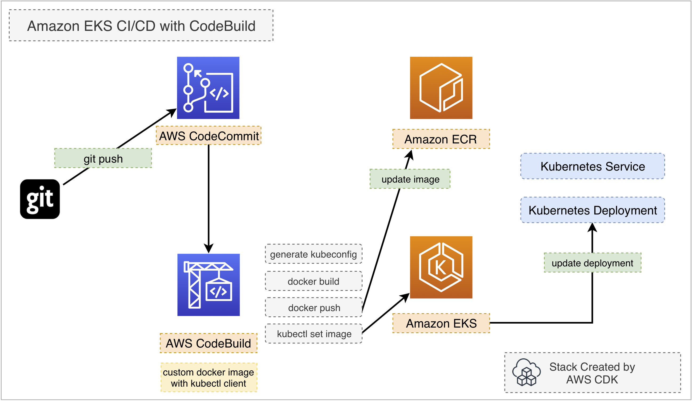

# Amazon EKS CI/CD with AWS CodeBuild

This project helps you build a complete Amazon EKS cluster with nodegroup and CI/CD pipeline with CodeBuild 100% in **AWS CDK**.



## Resource List

This stack provisions the following resources with **AWS CDK**

- [x] **Amazon EKS cluster**
- [x] **Amazon EKS nodegroup (with 2 m5.large workers)**
- [x] **AWS CodeBuild Project for Amazon EKS CI/CD**
- [x] **AWS CodeCommit as a sample source repo**
- [x] **Amazon ECR repository**

## Usage

Just deploy the stack with AWS CDK

```bash
$ git clone https://github.com/aws-samples/amazon-eks-cicd-codebuild.git
$ cd amazon-eks-cicd-codebuild/cdk
# use cdk init and default all answers (to create a package.json file)
$ cdk init
# install required packages defined in package.json
$ npm i
# this requires an existing default vpc with private subnets already defined,
# to create a new vpc (with the subnets needed) edit lib/cdk-stack.ts and replace the const vpc entry with the following

const vpc = new ec2.Vpc(this, 'NewVPC', {
  cidr: '10.0.0.0/16',
  natGateways: 1
})

# compile typescript to js
$ npm run build 
# if you have not used cdk in this account previously you may be advised to create the necessary resources in the account
$ cdk bootstrap aws://ACCOUNTNUMBER/us-east-1
# deploy the complete stack
$ cdk deploy
# when finished with the demo delete the created resources
# note that the flask resources were created independently of the cdk and must be deleted first
$ kubectl delete svc/flask-svc deploy/flask
$ cdk destroy
```

## Walkthrough

When you complete the `cdk deploy`, an empty **CodeCommit** repository will be created(check `Resource List` above to see all resource being created)

```bash
Outputs:
CdkStack.ClusterClusterNameEB26049E = cluster-e262edb4-e3f4-4384-82f3-366ea3b341de
CdkStack.ClusterConfigCommand43AAE40F = aws eks update-kubeconfig --name cluster-e262edb4-e3f4-4384-82f3-366ea3b341de --region us-west-2 --role-arn arn:aws:iam::112233445566:role/CdkStack-AdminRole38563C57-1US2EG9014AO1
CdkStack.CodeCommitRepoArn = arn:aws:codecommit:us-west-2:112233445566:CdkStack-repo
CdkStack.CodeCommitRepoName = CdkStack-repo
CdkStack.ClusterGetTokenCommand06AE992E = aws eks get-token --cluster-name cluster-e262edb4-e3f4-4384-82f3-366ea3b341de --region us-west-2 --role-arn arn:aws:iam::112233445566:role/CdkStack-AdminRole38563C57-1US2EG9014AO1
CdkStack.CodeCommitCloneUrlSsh = ssh://git-codecommit.us-west-2.amazonaws.com/v1/repos/CdkStack-repo
CdkStack.CodeCommitCloneUrlHttp = https://git-codecommit.us-west-2.amazonaws.com/v1/repos/CdkStack-repo
```

Verify the Amazon EKS is running **kubectl**

```bash
# copy the 'aws eks update-kubeconfig' command string and run it in the terminal to generate/update the kubeconfig
$ aws eks update-kubeconfig --name cluster-e262edb4-e3f4-4384-82f3-366ea3b341de --region us-west-2 --role-arn arn:aws:iam::112233445566:role/CdkStack-AdminRole38563C57-1US2EG9014AO1
# list the nodes with kubectl
$ kubectl get no
# deploy the initial flask sample service
$ kubectl apply -f ../flask-docker-app/k8s/flask.yaml
# list the service and deployment
$ kubectl get svc,deploy
```

Copy the ELB dns name from the **EXTERNAL-IP** column and open it in browser.

You will see the **Flask-demo** homepage.


```bash
# copy the ELB dns name from the EXTERNAL-IP column and open it in browser.
# You will see the Flask-demo homepage
# set codecommit as another upstream 
$ git remote add codecommit ssh://git-codecommit.us-west-2.amazonaws.com/v1/repos/CdkStack-repo
# push all current repo to codecommit. This will trigger CodeBuild for CI/CD.
$ git push -u codecommit master
```

Check the **CodeBuild** console to see the build status.

On build complete, reload the browser and see the **Flask-demo** homepage again. You will see the running platform string has changed from **Amazon Web Services** to **Amazon EKS**.


You may edit the [Dockerfile](https://github.com/pahud/eks-cicd-codebuild/blob/082d418aab1e2c65726d8980c46a8e336e8ed1b9/flask-docker-app/Dockerfile#L8) in **flask-docker-app** directory and specify different **PLATFORM** value

```bash
ENV PLATFORM 'Amazon EKS'
```

After you **git add**, **git commit** and **git push** to the **CodeCommit** source repository, **CodeBuild** will rebuild the docker image with new tag, push to Amazon ECR and immediately update the kubernetes deployment again. You may reload the browser to see the changes. 

## FAQ

Q:  when I `cdk deploy`, I got can't find **CDK_DEFAULT_REGION** or **CDK_DEFAULT_ACCOUNT** error.

A: You need configure your CDK environment, check [this chapter](https://docs.aws.amazon.com/en_us/cdk/latest/guide/environments.html) in AWS CDK Developer Guide to configure your Environment correctly.

Q: How can I create a new VPC rather than using the default VPC.

A:

```js
const vpc = new ec2.Vpc(this, 'NewVPC', {
  cidr: '10.0.0.0/16',
  natGateways: 1
})
```

However, if you create a new VPC, you might not be able to `cdk destroy` it after you `kubectl apply` some services in this VPC. Check [#5](https://github.com/aws-samples/amazon-eks-cicd-codebuild/issues/5) for more details and instructions.

Q: Got **VPC is not symmetric error** for default VPC

A: The **ec2.Vpc.fromLookup()** assumes the VPC specified is symmetric, check the [doc](https://docs.aws.amazon.com/cdk/api/latest/docs/aws-ec2-readme.html) here. If you specify the default VPC and get this error, you probably need to check if you have public and private subnets in every AZ and make sure they are symmetric. (Ref: [aws/aws-cdk/issues/3407](https://github.com/aws/aws-cdk/issues/3407))

Q: Can I build this with my existing Amazon EKS cluster?

A: Yes. You can import the existing Amazon EKS cluster with **eks.Cluster.fromClusterAttributes()**

Q: The *cdk destroy* fails due to dependencies that cannot be deleted

A: The flask app dependencies must be deleted with kubectl before the *cdk destroy*

## License

This library is licensed under the MIT-0 License. See the [LICENSE](/LICENSE) file.
